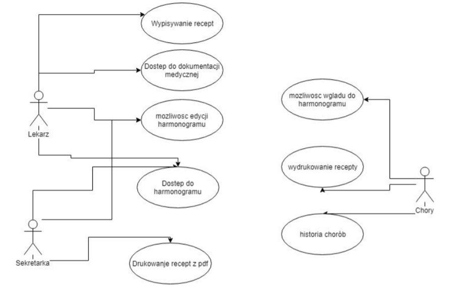
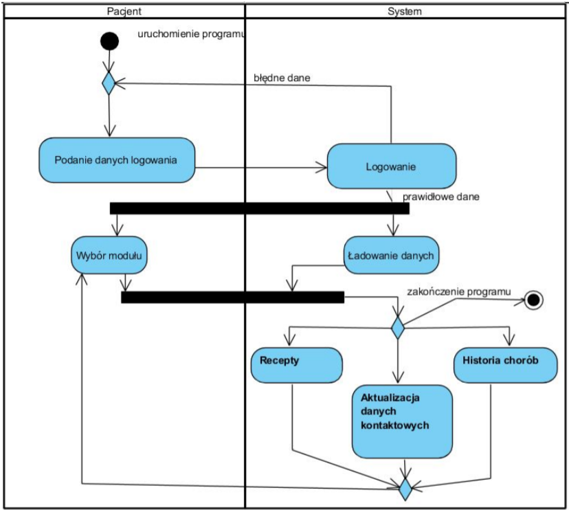
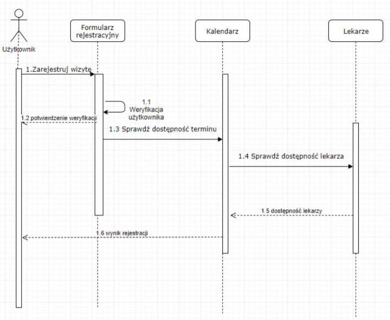
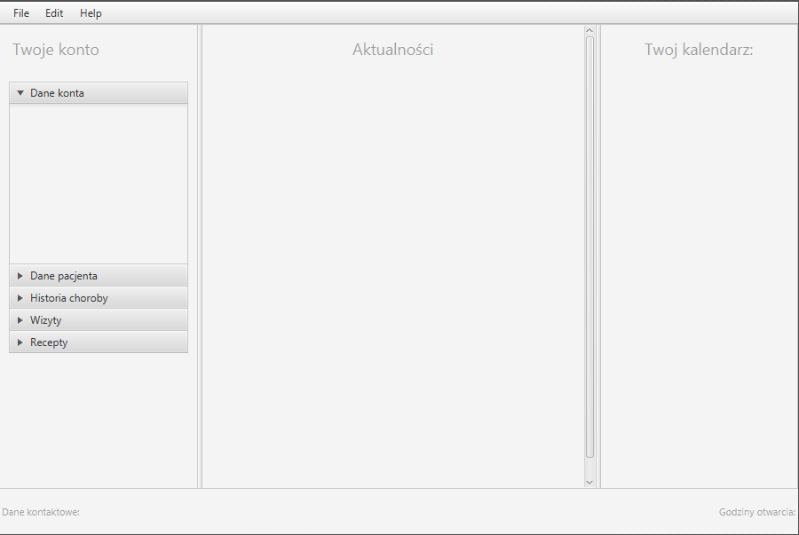
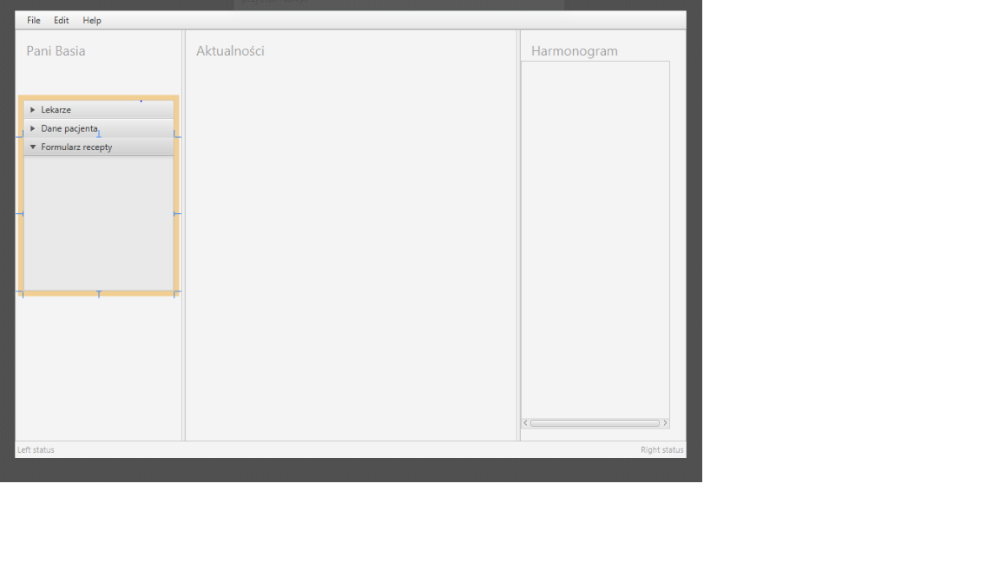
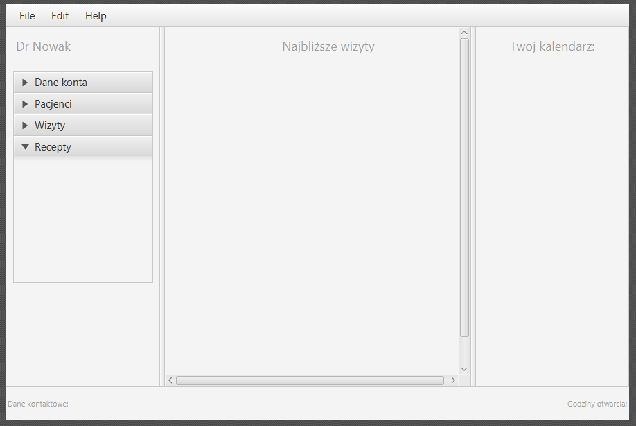

# Aplikacja do zarządzania przychodnią
## Autorzy
- Damian Rolewski
- Krzysztof Pięta
- Mateusz Matyaszek
- Mateusz Sobkowicz
# Spis treści
* [Opis aplikacji](#opis-aplikacji)
* [Schematy UML](#schematy-uml)
* [Wykorzystane technologie](#wykorzystane-technologie)
# Opis aplikacji
Celem aplikacji jest obsługa przychodni medycznej poprzez możliwość tworzenia i odczytywania danych medycznych pacjentów, historii chorób oraz recept w celu poprawienia świadomości chorego oraz ułatwienia kontaktu lekarz-pacjent. Aplikacja umożliwia rejestrację chorego w przychodni bez wychodzenia z domu a także pozwala mu na sprawdzenie listy przypisanych mu leków.

Dane aplikacji gromadzone są w relacyjnej bazie danych, do której pełny dostęp mają tylko administratorzy, a częściowy, w zależności od uprawnień lekarze i pacjenci.

Aplikacja jest obsługiwana przez trzy segmenty użytkowników, z których każdy ma inny zakres możliwości.
- Pacjent:
Osoba niezalogowana/zarejestrowana ma dostęp jedynie do formularza logowania/rejestracji. 
- Lekarz:
Po zalogowaniu użytkownik oprócz funkcji użytkownika niezalogowanego otrzymuje dodatkowe możliwości. Dzięki nim ma dostęp do podgląd danych dotyczących jego konta. Może przejrzeć raport w postaci tabeli lub wykresu.
- Administrator/ recepcjonista:
Jako osoba z największymi uprawnieniami administrator ma dostęp do wszystkich informacji 
w bazie danych. Dzięki uprawnieniom może dodawać oraz usuwać lekarzy czy pacjentów, tworzyć historię chorób oraz listy recept. Może on także manualnie zmieniać wpisy w bazie danych.
 
Aplikacja może znaleźć zastosowanie w realnym świecie gdzie usprawni działanie placówek poprzez zmniejszenie kosztów utrzymywania dokumentacji papierowej. Dzięki popularyzacji podniesie świadomość chorych i umożliwi wczesne reagowanie na objawy choroby. Poprzez zdalną rejestrację pomoże w lepszym zarządzaniu placówką.

# Schematy UML:
- Diagram przypadków użycia:

- Diagram aktywności:

- Diagram sekwencji:

- Diagram klas:

# Projekt okien użytkowników:

## Projekt okna logowania:

## Projekt okna rejestracji:

## Projekt okna pacjenta:

## Projekt okna recepcjonistki:

## Projekt okna lekarza: 

# Wykorzystane technologie:
